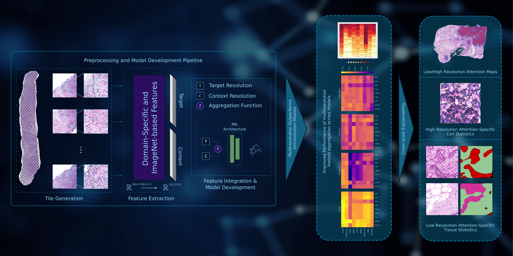

This repository contains the code for the paper "**Unveiling the Power of Model-Agnostic Multiscale Analysis for Enhancing Artificial Intelligence Models in Breast Cancer Histopathology Images**" published in Journal of Biomedical and Health Informatics, IEEE, [https://doi.org/10.1109/JBHI.2024.3413533](https://doi.org/10.1109/JBHI.2024.3413533).

# Abstract
Developing AI models for digital pathology has traditionally relied on single-scale analysis of histopathology slides. However, a whole slide image is a rich digital representation of the tissue, captured at various magnification levels. Limiting our analysis to a single scale overlooks critical information, spanning from intricate high-resolution cellular details to broad low-resolution tissue structures. In this study, we propose a model-agnostic multiresolution feature aggregation framework tailored for the analysis of histopathology slides in the context of breast cancer, on a multicohort dataset of 2038 patient samples. We have adapted 8 state-of-the-art multiple instance learning models on our multi-scale methodology and evaluated their performance on grade prediction, TP53 mutation status prediction and survival prediction. The results prove the dominance of the multiresolution methodology, and specifically, concatenating the feature vectors of image patches from a high (20x) and low (10x) magnification factors achieves improved performance for all prediction tasks across domain-specific and imagenet-based features. On the contrary, the performance of uniresolution baseline models was not consistent across domain-specific and imagenet-based features. Moreover, we shed light on the inherent inconsistencies observed in models trained on whole-tissue-sections when validated against biopsy-based datasets. Despite these challenges, our findings underscore the superiority of multiresolution analysis over uniresolution methods. Finally, cross-scale analysis also benefits the explainability aspects of attention-based architectures, since one can extract attention maps at the tissue- and cell-levels, improving the interpretation of the model's decision.

# QuPath Annotations
QuPath annotations should be exported as a GeoJson file to use for extracting tiles for the annotated ROIs.

# Packages Needed
- [tsikup/pytorch_models](https://github.com/tsikup/pytorch_models)
- [tsikup/wsi_data](https://github.com/tsikup/wsi_data)
- [tsikup/pathology-whole-slide-data/tree/qupath](https://github.com/tsikup/pathology-whole-slide-data/tree/qupath)
- [tsikup/he_preprocessing](https://github.com/tsikup/he_preprocessing)
- [tsikup/my_utils](https://github.com/tsikup/my_utils)
